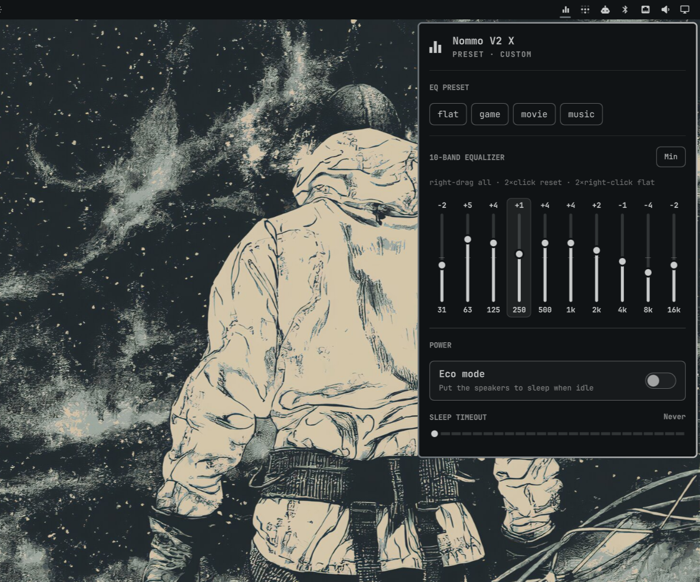

# nommarchy

Razer Nommo V2 X control panel for [Omarchy](https://omarchy.org/) (Linux).

A native port of the macOS [nommac](https://github.com/pablopunk/nommac)
menu-bar app. It talks directly to the speakers' vendor HID interface over
USB — the same 90-byte feature-report protocol (report ID `0x07`) that Razer
Synapse uses on Windows — so you get every setting Synapse has with no
Synapse, no drivers, and no bloat.



| Setting        | Supported |
|----------------|-----------|
| 10-band EQ     | ✅ 31 Hz – 16 kHz, ±12 dB |
| EQ presets     | ✅ Flat / Game / Movie / Music |
| Eco mode       | ✅ power saving toggle |
| Sleep timeout  | ✅ including *Never* (stop the speakers sleeping mid-song) |

Settings are written to the speaker firmware, so they **persist across
reboots and re-plugs**.

## Install

### 1. Add the shell plugin

```bash
omarchy plugin add https://github.com/pablopunk/nommarchy.git
```

### 2. Install the backend + udev rule

The plugin drives the tiny `nommarchy` CLI, which needs to be on `PATH` and
needs unprivileged access to the speakers' HID interface:

```bash
cd ~/.config/omarchy/plugins/pablopunk.nommarchy
sudo ./install.sh
```

That installs `nommarchy` to `/usr/local/bin` and drops a udev rule so your
user can open the device without `sudo`. The plugin's service also installs a
launcher entry (`~/.local/share/applications/nommarchy.desktop`), so
"Nommarchy" appears in the Omarchy menu and behaves like an app.

> The plugin runs unsandboxed inside the Omarchy shell (like any shell
> plugin) and shells out to `nommarchy`. It never touches the network, never
> records, and only writes to the speakers when you interact with it.

## Usage

Launch it like an app — from the Omarchy menu (search **Nommarchy**) or the
**equalizer icon** in the bar:

- **left-click** the bar icon → open/close the panel
- **right-click** the bar icon → quit (removes the icon; relaunch from the menu)

In the panel:

- **drag** a vertical bar → edit that band
- **right-drag** → shift the whole 10-band curve at once
- **double-click** a bar → reset that band to 0 dB
- **double right-click** → flatten all ten bands
- **scroll** a bar → nudge it ±1 dB
- **↑/↓** nudge the focused band, **←/→** move focus, **Esc** closes

You can also toggle it from a terminal or a keybind:

```bash
omarchy-shell shell toggle pablopunk.nommarchy
```

The `nommarchy` binary doubles as a command-line tool:

```bash
nommarchy status                      # show all settings
nommarchy eco on|off                  # power saving (auto sleep)
nommarchy sleep 30 | sleep off        # idle sleep timeout in minutes
nommarchy eq show | eq flat           # current 10-band EQ / reset to 0 dB
nommarchy eq min                      # every band at the -12 dB floor
nommarchy eq 4 3 2 0 0 0 0 1 2 3      # set bands: 31 63 125 250 500 1k 2k 4k 8k 16k
nommarchy preset music                # flat|game|movie|music
nommarchy json                        # machine-readable state (for the shell)
```

## How it works

The Nommo V2 X exposes a vendor HID feature report (report ID `0x07`, 90
bytes) alongside its USB audio. `nommarchy` writes a request and reads the
staged response over `/dev/hidraw*` using the standard `HIDIOCSFEATURE` /
`HIDIOCGFEATURE` ioctls — no third-party libraries. Protocol reverse
engineered in [openrazer#2758](https://github.com/openrazer/openrazer/issues/2758).

| Setting | Command |
|---------|---------|
| Eco mode | `0x07/0x08` (read `0x88`) |
| Sleep timeout | `0x07/0x03` (read `0x83`, big-endian seconds; writing re-enables eco, so it is saved/restored) |
| 10-band EQ | `0x08/0x04` (read `0x84`; `0x0C` = 0 dB, one unit per dB) |
| EQ preset | `0x08/0x02` (read `0x82`; 0–3, `0x10` = custom) |

Master volume is deliberately not exposed: it is the USB audio volume, which
the OS already controls.

> **Presets:** the flat/game/movie/music curves are firmware built-ins that the
> device does *not* expose over HID — only the custom 10-band curve is readable.
> Selecting a preset therefore shows the bars reset to flat (matching the macOS
> app's behaviour); the bars reflect the real editable curve once you drag a
> band and the device switches to Custom.

## Uninstall

```bash
omarchy plugin remove pablopunk.nommarchy
cd ~/.config/omarchy/plugins/pablopunk.nommarchy 2>/dev/null && sudo ./install.sh --uninstall
# or by hand:
sudo rm -f /usr/local/bin/nommarchy /etc/udev/rules.d/99-nommo.rules
```

## License

[MIT](LICENSE) — derived from [nommac](https://github.com/pablopunk/nommac).
